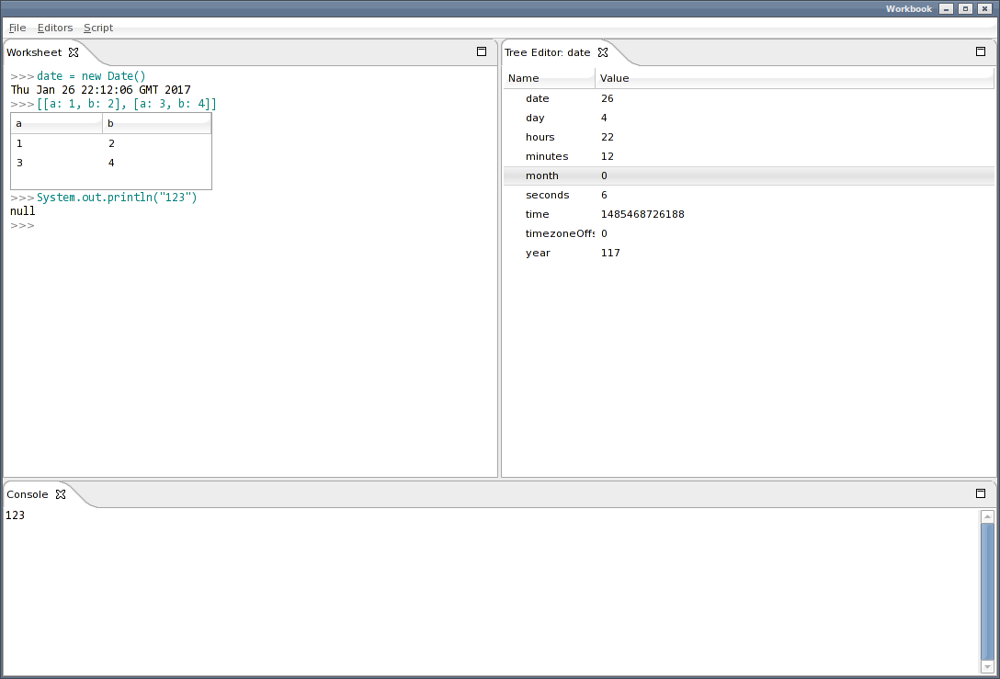
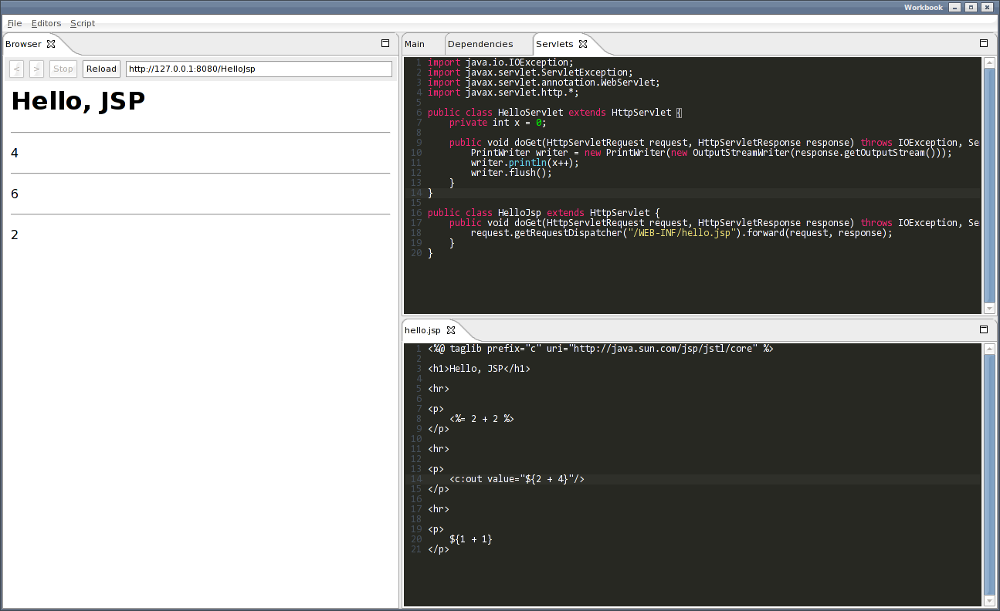

Workbook
========

A workbook for JSR-223 scripting languages (Groovy, JavaScript, JRuby), allowing the evaluation of commands
along with other views and editors.

Features
--------

* Run commands against a scripting engine.
* Two-way editors, tab views, and inline views.
* Save workbook to a file, saving tab layout, global variables, and editor states.
* Run from Java program to access variables and execute methods from that program.
* Register custom views and editors using SWT widgets.

Installation
------------

* Replace lib/swt.jar with your platform specific library from: from http://www.eclipse.org/swt/.

* Build with ant:

        ant jar
    
Usage
-----

Run jar:

    java -jar workbook.jar

or run from Java:

	Workbook workbook = new Workbook();
	workbook.addVariable(...);
	workbook.waitForExit();
